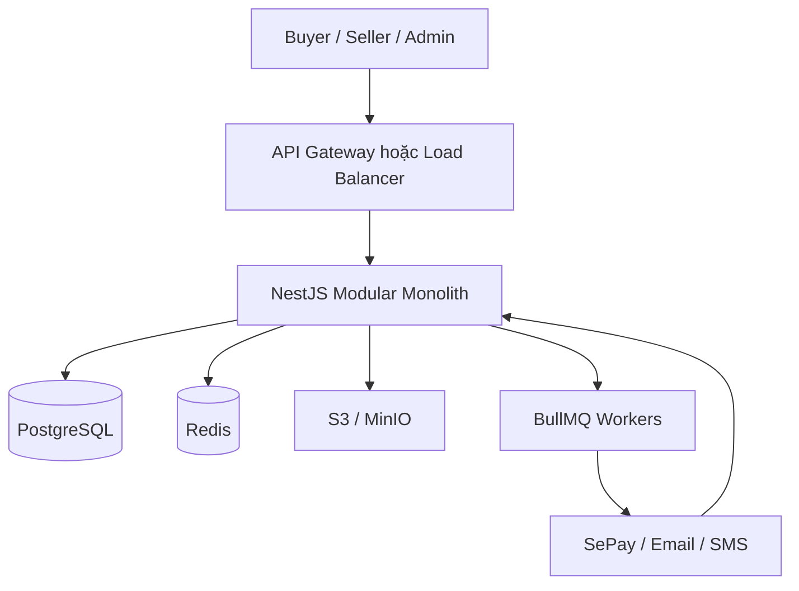
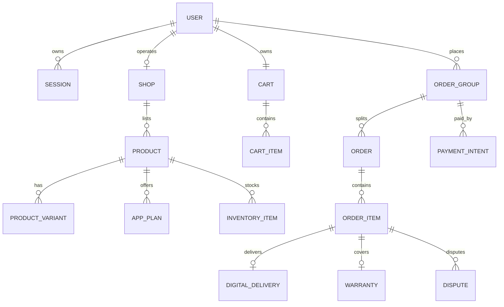
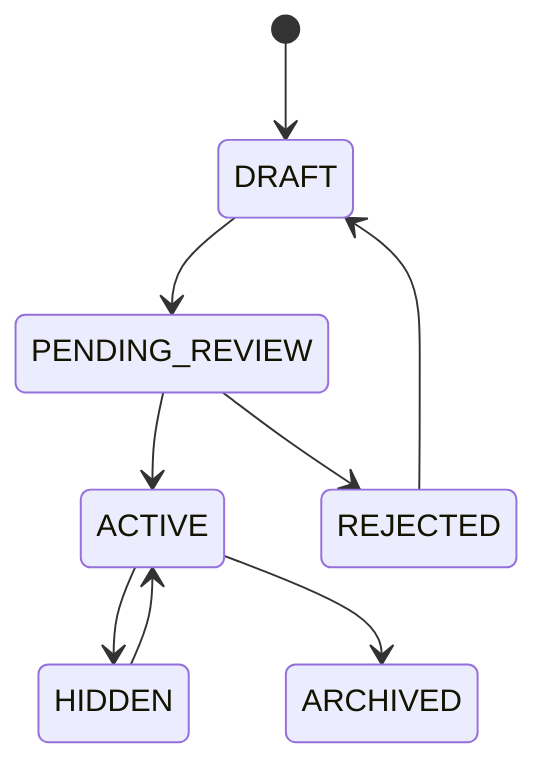
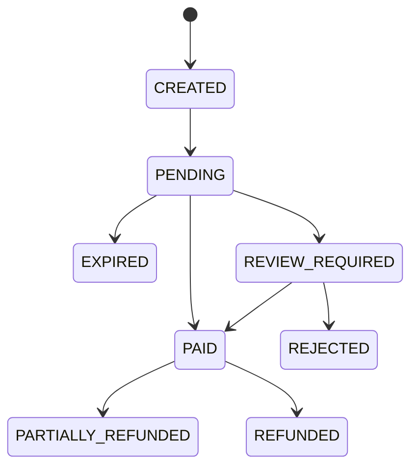
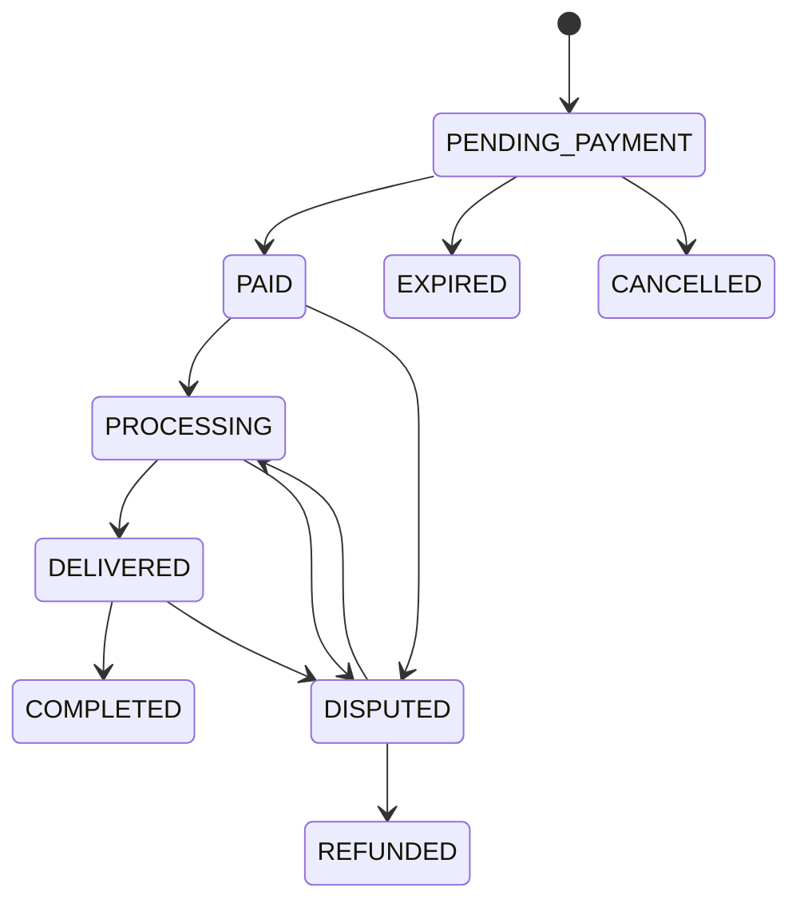
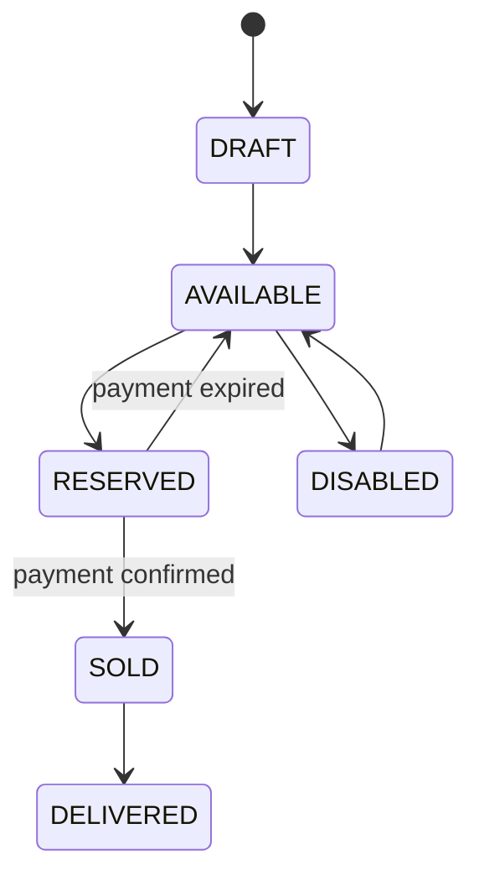

# THIẾT KẾ BACKEND WEBSITE THƯƠNG MẠI ĐIỆN TỬ

> Blueprint kỹ thuật tổng thể cho marketplace bán hàng vật lý, tài khoản game và tài khoản ứng dụng.

## 0. Thông tin tài liệu

| Thuộc tính | Giá trị |
|---|---|
| Trạng thái | Bản thiết kế nền tảng trước khi lập trình backend |
| Kiến trúc đề xuất | Modular Monolith, sẵn sàng tách dịch vụ khi cần |
| Backend | NestJS + TypeScript |
| Cơ sở dữ liệu | PostgreSQL |
| ORM | Prisma; dùng SQL trực tiếp cho lock/query đặc biệt |
| Cache và queue | Redis + BullMQ |
| File storage | S3-compatible hoặc MinIO |
| API | REST, OpenAPI 3.x, WebSocket cho realtime |
| Thanh toán | SePay webhook, thiết kế mở cho nhiều cổng |
| Client hiện có | Buyer Web, Seller Web, Admin Web |

Tài liệu này là nguồn chuẩn để tạo database schema, API contract, backlog và test. Khi có thay đổi nghiệp vụ, phải cập nhật tài liệu và OpenAPI trước hoặc cùng lúc với code.

---

## 1. Tầm nhìn sản phẩm

Xây dựng một marketplace có khả năng phục vụ thị trường lớn, hỗ trợ đồng thời ba loại sản phẩm:

1. `PHYSICAL`: hàng hóa vật lý, có biến thể, tồn kho và vận chuyển.
2. `DIGITAL_GAME_ACCOUNT`: tài khoản game, bàn giao credential sau thanh toán.
3. `DIGITAL_APP_ACCOUNT`: tài khoản ứng dụng, license key, tài khoản cấp sẵn, lời mời Family/Team hoặc kích hoạt qua email.

Ba loại sản phẩm tồn tại song song. Tài khoản ứng dụng là tính năng bổ sung, không thay thế tài khoản game.

### 1.1. Giá trị chính

- Người mua tìm kiếm, so sánh, đặt hàng và nhận sản phẩm thuận tiện.
- Người bán quản lý shop, sản phẩm, gói bán, tồn kho, đơn hàng và doanh thu.
- Admin kiểm duyệt, hỗ trợ, xử lý tranh chấp, vận hành thanh toán và kiểm soát rủi ro.
- Hàng hóa số được giữ, cấp phát và xem credential có kiểm soát.
- Mọi nghiệp vụ tài chính có ledger và audit, không phụ thuộc dữ liệu hiển thị trên FE.

### 1.2. Mục tiêu quy mô dùng để thiết kế

Đây là mục tiêu kỹ thuật định hướng, không phải dự báo kinh doanh:

| Giai đoạn | Người dùng đăng ký | DAU | Đơn/ngày | Peak API |
|---|---:|---:|---:|---:|
| MVP | 10.000 | 1.000 | 500 | 50 req/s |
| Growth | 500.000 | 50.000 | 20.000 | 1.000 req/s |
| Large market | 5.000.000+ | 500.000+ | 200.000+ | 10.000 req/s |

Thiết kế ban đầu không cần chạy ngay ở quy mô cuối, nhưng ID, index, partition, cache, queue, idempotency và audit phải cho phép mở rộng mà không viết lại toàn bộ domain.

---

## 2. Bài toán cần giải quyết

### 2.1. Bài toán marketplace nhiều shop

Một giỏ hàng có thể chứa sản phẩm từ nhiều shop và nhiều loại fulfillment. Hệ thống phải:

- Tính giá từ dữ liệu server.
- Tách một checkout thành nhiều seller order.
- Cho phép một payment intent thanh toán cho một order group.
- Tách doanh thu, phí, hoàn tiền và tranh chấp theo từng order hoặc order item.
- Không để shop A nhìn thấy dữ liệu của shop B.

### 2.2. Bài toán tồn kho cạnh tranh

Nhiều người có thể mua cùng một biến thể hoặc credential cuối cùng tại cùng thời điểm. Hệ thống phải bảo đảm:

- Không bán âm tồn kho.
- Không giao một tài khoản số cho hai người.
- Giữ hàng trong thời gian thanh toán.
- Tự trả hàng về kho khi payment hết hạn.
- Cho phép retry request mà không tạo đơn trùng.

### 2.3. Bài toán thanh toán bất đồng bộ

Người dùng tạo đơn trước, chuyển khoản sau; webhook có thể đến trễ, đến lặp hoặc sai nội dung. Backend phải:

- Tạo mã thanh toán duy nhất.
- Xác thực webhook.
- Chống xử lý giao dịch lặp.
- Đối chiếu số tiền, loại tiền và nội dung.
- Chỉ xác nhận đơn một lần.
- Xử lý giao dịch thiếu/thừa tiền bằng luồng đối soát.

### 2.4. Bài toán giao hàng số an toàn

Credential là dữ liệu có giá trị. Hệ thống phải:

- Mã hóa khi lưu.
- Không xuất hiện trong log, analytics hoặc API danh sách.
- Chỉ buyer sở hữu đơn đã thanh toán, seller có quyền phù hợp hoặc admin có quyền riêng mới được reveal.
- Ghi lại ai đã xem, thời điểm, IP, thiết bị và lý do.
- Hạn chế cache, tải xuống và lạm dụng endpoint reveal.

### 2.5. Bài toán thời hạn và bảo hành

Mỗi plan ứng dụng có hai khái niệm độc lập:

- `service_duration`: thời gian sử dụng dịch vụ.
- `warranty_duration`: thời gian được bảo hành.

Gợi ý nhập nhanh: 1, 3, 6, 12, 14, 18, 24 tháng. Người bán được nhập tay giá trị khác trong giới hạn cấu hình. Khi đặt hàng, hệ thống phải snapshot chính sách và tính ngày hết hạn từ server.

### 2.6. Bài toán kiểm duyệt và gian lận

- Sản phẩm vi phạm hoặc mô tả sai.
- Shop bán credential đã dùng, bán trùng hoặc không đúng cam kết.
- Người mua chargeback/tranh chấp bất thường.
- Spam review, chat, báo cáo hoặc thử credential hàng loạt.
- Tài khoản bị chiếm quyền và thao tác tài chính trái phép.

Giải pháp là kết hợp rule engine, risk score, audit log, hạn mức, kiểm duyệt con người và AI hỗ trợ; AI không được tự quyết định hoàn tiền/khóa vĩnh viễn nếu chưa có chính sách rõ ràng.

---

## 3. Phạm vi chức năng

### 3.1. Buyer

- Đăng ký, đăng nhập, xác minh email/điện thoại, quản lý phiên.
- Tìm kiếm, lọc, xem chi tiết và so sánh sản phẩm.
- Giỏ hàng nhiều shop và nhiều loại sản phẩm.
- Checkout, voucher, địa chỉ, vận chuyển và thanh toán.
- Theo dõi order group, seller order và từng item.
- Reveal credential/mã license sau khi đủ điều kiện.
- Xác nhận đã nhận, đánh giá, bảo hành, đổi trả, khiếu nại.
- Chat với shop/admin, nhận thông báo.

### 3.2. Seller

- Đăng ký seller và KYC/KYB.
- Quản lý shop, nhân viên và quyền nội bộ.
- Đăng hàng vật lý, tài khoản game, tài khoản ứng dụng.
- Tạo nhiều plan ứng dụng với giá, thời hạn và bảo hành riêng.
- Nhập kho vật lý, credential, license key hoặc slot.
- Xử lý đơn, hỗ trợ khách, bảo hành và tranh chấp.
- Xem doanh thu, số dư khả dụng, số dư đang giữ và payout.

### 3.3. Admin

- Quản lý user, seller, shop, danh mục và catalog chuẩn.
- Duyệt sản phẩm và hồ sơ seller.
- Điều tra order, payment, delivery, warranty và dispute.
- Quản lý vi phạm, khóa/mở khóa, ẩn sản phẩm.
- Điều chỉnh tài chính bằng nghiệp vụ ledger có phê duyệt.
- Xem credential hoặc mật khẩu theo quyền đặc biệt và có audit.
- Dashboard vận hành, hộp thư và báo cáo.

### 3.4. Ngoài phạm vi phiên bản đầu

- Logistics tự vận hành trên toàn quốc.
- Microservices đầy đủ.
- Multi-region active-active.
- AI tự động ra quyết định tài chính hoặc khóa tài khoản vĩnh viễn.
- Crypto payment.

---

## 4. Nguyên tắc kiến trúc

1. Backend là nguồn sự thật duy nhất cho giá, tồn kho, trạng thái và quyền thao tác.
2. FE không được tự sửa tổng tiền hoặc tự chuyển trạng thái nghiệp vụ.
3. API nhận command có mục đích, không nhận object `Partial<Entity>` quá rộng.
4. Mọi mutation quan trọng hỗ trợ idempotency và audit.
5. Transaction ngắn; tác vụ chậm chuyển qua queue.
6. Dùng outbox pattern để không mất event sau khi commit database.
7. Dữ liệu public, seller-private và admin-sensitive dùng DTO riêng.
8. Không log secret, token, password, cookie, OTP và credential plaintext.
9. Thiết kế API versioned từ đầu: `/api/v1`.
10. Bắt đầu modular monolith; chỉ tách service khi có số liệu chứng minh cần thiết.

---

## 5. Kiến trúc tổng thể



### 5.1. Vì sao dùng modular monolith

- Phù hợp đội nhỏ và giai đoạn sản phẩm chưa ổn định.
- Transaction checkout, inventory và ledger dễ bảo đảm hơn microservices.
- Deploy, debug và test đơn giản.
- Module có boundary rõ để sau này tách Payment, Search, Chat hoặc Notification.

### 5.2. Cấu trúc repository đề xuất

```text
backend/
├── apps/
│   ├── api/
│   └── worker/
├── src/modules/
│   ├── auth/
│   ├── users/
│   ├── shops/
│   ├── catalog/
│   ├── products/
│   ├── inventory/
│   ├── carts/
│   ├── checkout/
│   ├── orders/
│   ├── payments/
│   ├── delivery/
│   ├── warranty/
│   ├── disputes/
│   ├── finance/
│   ├── chat/
│   ├── media/
│   ├── admin/
│   └── audit/
├── src/common/
├── prisma/
├── openapi/
├── test/
└── docker-compose.yml
```

---

## 6. Domain model

### 6.1. Các bounded context

| Domain | Trách nhiệm |
|---|---|
| Identity | User, credential đăng nhập, session, MFA, role |
| Seller | Hồ sơ đăng ký, shop, nhân viên shop, sanction |
| Catalog | Danh mục, brand, game catalog, app catalog, attribute schema |
| Product | Sản phẩm, plan/variant, giá, ảnh, kiểm duyệt |
| Inventory | Kho vật lý, credential, license, reservation |
| Commerce | Cart, checkout, voucher, order group, order, order item |
| Payment | Payment intent, transaction, webhook, reconciliation |
| Fulfillment | Shipping và digital delivery |
| After-sales | Review, return, warranty, dispute, evidence |
| Finance | Wallet, ledger, platform fee, refund, payout |
| Engagement | Chat, notification, favorite, follow |
| Governance | Admin action, report, audit, risk signal |

### 6.2. Phân loại sản phẩm canonical

```ts
type ProductType =
  | 'PHYSICAL'
  | 'DIGITAL_GAME_ACCOUNT'
  | 'DIGITAL_APP_ACCOUNT';
```

`product_type` là bắt buộc và không được thay đổi sau khi sản phẩm có order item.

### 6.3. Fulfillment cho tài khoản ứng dụng

```ts
type AppFulfillmentType =
  | 'PRE_CREATED_ACCOUNT'
  | 'LICENSE_KEY'
  | 'BUYER_EMAIL_ACTIVATION'
  | 'FAMILY_OR_TEAM_INVITATION'
  | 'MANUAL_SERVICE';
```

- `PRE_CREATED_ACCOUNT`: shop nạp credential, hệ thống cấp sau thanh toán.
- `LICENSE_KEY`: hệ thống cấp key chưa sử dụng.
- `BUYER_EMAIL_ACTIVATION`: chỉ thu email/tên tài khoản cần kích hoạt; không thu OTP của buyer.
- `FAMILY_OR_TEAM_INVITATION`: thu email để gửi lời mời.
- `MANUAL_SERVICE`: admin kiểm soát schema field; cấm field tài chính/OTP nếu chính sách không cho phép.

---

## 7. Thiết kế dữ liệu

### 7.1. ERD mức domain



### 7.2. Nhóm bảng Identity

#### `users`

- `id UUID/UUIDv7`
- `email_normalized`, `phone_normalized`
- `password_hash`
- `status`: ACTIVE, SUSPENDED, BANNED, DELETED
- `email_verified_at`, `phone_verified_at`
- `failed_login_count`, `locked_until`
- `created_at`, `updated_at`, `deleted_at`

Unique index trên email/phone normalized và partial index để hỗ trợ soft delete.

#### `sessions`

- Hash của refresh token, không lưu token thô.
- User, device ID, IP, user agent, expiry, revoked time.
- Token rotation và reuse detection.

#### `roles`, `permissions`, `user_roles`, `role_permissions`

Cho phép RBAC mở rộng thay vì hard-code toàn bộ role vào controller.

### 7.3. Nhóm bảng Shop và Seller

- `seller_applications`
- `shops`
- `shop_members`
- `shop_bank_accounts`
- `shop_kyc_documents`
- `shop_sanctions`
- `shop_settings`

KYC và ngân hàng phải tách khỏi public shop DTO. Field nhạy cảm mã hóa ở application layer hoặc database encryption phù hợp.

### 7.4. Nhóm bảng Product

#### `products`

- Thông tin chung: shop, type, slug, name, description, status.
- Giá hiển thị chỉ là denormalized minimum price; giá mua lấy từ variant/plan.
- `version` phục vụ optimistic concurrency.
- `published_at`, `reviewed_at`, `reviewed_by`.

#### Bảng chuyên biệt

- `physical_product_details`
- `game_account_details`
- `app_account_details`
- `product_variants`
- `app_plans`
- `product_images`
- `product_attribute_values`
- `buyer_field_definitions`
- `warranty_policies`

Không dùng một bảng JSON khổng lồ cho toàn bộ sản phẩm. JSONB chỉ dùng cho attribute linh hoạt, vẫn phải validate theo schema version.

### 7.5. `app_plans`

- `product_id`
- `sku`
- `name`
- `price_amount`, `compare_at_amount`, `currency`
- `fulfillment_type`
- `service_duration_value`, `service_duration_unit`
- `warranty_duration_value`, `warranty_duration_unit`
- `delivery_estimate_minutes`
- `purchase_limit`
- `status`, `version`

Preset bảo hành: `[1, 3, 6, 12, 14, 18, 24]` tháng. Giá trị nhập tay phải là số nguyên dương và có giới hạn, ví dụ tối đa 120 tháng hoặc theo cấu hình Admin.

### 7.6. Nhóm bảng Inventory

#### `inventory_items`

- `product_id`, `variant_id` hoặc `app_plan_id`
- `inventory_type`: PHYSICAL_UNIT, GAME_CREDENTIAL, APP_CREDENTIAL, LICENSE_KEY, SLOT
- `status`: DRAFT, AVAILABLE, RESERVED, SOLD, DELIVERED, DISABLED
- `encrypted_payload`
- `payload_key_version`
- `reserved_for_order_id`, `reserved_until`
- `sold_order_item_id`
- `created_by`, timestamps

Không dùng cột plaintext cho login/password/token/cookie.

#### `inventory_reservations`

- Unique active reservation cho mỗi inventory item.
- Có expiry và worker giải phóng.
- Có `order_group_id`, `payment_intent_id` và idempotency key.

### 7.7. Nhóm bảng Commerce

- `carts`, `cart_items`
- `checkout_sessions`
- `order_groups`
- `orders`
- `order_items`
- `order_status_history`
- `order_item_snapshots`
- `vouchers`, `voucher_redemptions`

Order item phải snapshot:

- Tên sản phẩm, SKU/plan.
- Product type, fulfillment type.
- Giá, phí, discount, currency.
- Service duration, warranty duration.
- Chính sách giao hàng/bảo hành tại thời điểm mua.

Việc seller sửa hoặc xóa sản phẩm sau này không được làm thay đổi đơn cũ.

### 7.8. Nhóm bảng Payment và Finance

- `payment_intents`
- `payment_transactions`
- `payment_webhook_events`
- `payment_reconciliations`
- `wallets`
- `ledger_entries`
- `refunds`
- `seller_payouts`
- `platform_fee_rules`

Tiền lưu bằng integer ở đơn vị nhỏ nhất, với VND là số đồng. Không dùng floating point.

Ledger dùng double-entry hoặc tối thiểu immutable append-only entries. Không cập nhật trực tiếp `wallet_balance` mà không tạo ledger entry.

### 7.9. After-sales và Governance

- `reviews`, `review_votes`
- `warranties`, `warranty_claims`
- `returns`
- `disputes`, `dispute_messages`, `dispute_evidence`
- `user_reports`
- `risk_signals`
- `admin_actions`
- `audit_logs`

Evidence lưu dưới dạng `media_asset_id`, không nhận URL tùy ý làm bằng chứng chính.

---

## 8. Chính sách mật khẩu và credential

### 8.1. Hai loại dữ liệu phải tách biệt

| Loại | Ví dụ | Cách lưu |
|---|---|---|
| Password đăng nhập website | Password Buyer/Seller/Admin | `password_hash` để xác thực |
| Credential hàng hóa số | Email/pass game, app, license, recovery data | Mã hóa có khả năng giải mã |

### 8.2. Yêu cầu Admin xem mật khẩu người dùng website

Theo yêu cầu sản phẩm, Admin có thể xem mật khẩu. Cách triển khai có kiểm soát:

1. Login vẫn kiểm tra bằng `password_hash` Argon2id.
2. Nếu bắt buộc khôi phục plaintext, lưu thêm bản mã trong `user_password_vault`, không để trong `users`.
3. Dùng envelope encryption: mỗi record có Data Encryption Key; DEK được mã hóa bằng master key/KMS.
4. Endpoint reveal riêng, không trả trong API danh sách hoặc chi tiết user thông thường.
5. Chỉ permission `USER_PASSWORD_REVEAL` hoặc `SUPER_ADMIN` được dùng.
6. Bắt buộc Admin xác thực lại, MFA, nhập lý do và mã ticket hỗ trợ.
7. Mặc định che dữ liệu; mỗi lần reveal có audit bất biến.
8. Rate limit, alert khi xem hàng loạt và có thể yêu cầu phê duyệt hai người.
9. Không cho frontend cache, lưu localStorage hoặc analytics plaintext.
10. Có feature flag để vô hiệu hóa nhanh khi xảy ra sự cố.

Lưu ý kiến trúc: password hash một chiều không thể giải mã. Yêu cầu “xem mật khẩu hiện tại” buộc hệ thống giữ một bản mã có thể giải mã và làm tăng đáng kể phạm vi thiệt hại khi key hoặc quyền Admin bị lộ. Phương án an toàn hơn vẫn là Admin tạo mật khẩu tạm thời một lần hoặc gửi reset link. Quyết định cuối phải được ghi trong tài liệu rủi ro và được chủ sản phẩm chấp thuận.

### 8.3. Reveal credential hàng hóa số

```text
Client → POST /digital-deliveries/{id}/reveal
       → Auth + ownership + payment + order state
       → Re-auth/MFA nếu policy yêu cầu
       → Rate limit
       → Decrypt tại service boundary
       → Ghi audit
       → Trả no-store response
```

Header bắt buộc:

```http
Cache-Control: no-store, private
Pragma: no-cache
```

---

## 9. State machine

### 9.1. Product



### 9.2. Payment



### 9.3. Order



### 9.4. Inventory item



Chỉ domain service được chuyển trạng thái. API không nhận `newStatus` tùy ý mà dùng command như `confirmPayment`, `shipOrder`, `confirmReceived`, `resolveDispute`.

---

## 10. Thuật toán nghiệp vụ cốt lõi

### 10.1. Thuật toán phân loại cart item

Không đoán bằng slug hoặc prefix ID. Mỗi item lưu `product_type` bắt buộc và reference hợp lệ:

```text
PHYSICAL                 → product_variant_id bắt buộc
DIGITAL_GAME_ACCOUNT     → product_id hoặc inventory policy bắt buộc
DIGITAL_APP_ACCOUNT      → app_plan_id bắt buộc
```

Database constraint hoặc service validation phải chặn tổ hợp không hợp lệ.

### 10.2. Thuật toán preview checkout

```pseudo
function previewCheckout(userId, selectedCartItemIds, addressId, vouchers):
  items = loadSelectedItemsOwnedBy(userId)
  assert all items are ACTIVE and purchasable
  reload current price and stock from server

  groups = group items by shopId
  for each group:
    subtotal = sum(unitPrice * quantity)
    shipping = calculateShipping(physicalItems, addressId)
    sellerDiscount = validateSellerVouchers(group)
    platformDiscount = validatePlatformVouchers(group)
    tax = calculateTax(group)
    total = subtotal + shipping + tax - discounts

  return signed checkout snapshot with expiresAt
```

Preview có TTL ngắn. Khi create order, backend phải tính/kiểm tra lại, không tin số tiền FE gửi.

### 10.3. Thuật toán tạo order group idempotent

```pseudo
transaction:
  if idempotencyKey already completed:
    return previous response

  lock cart items and relevant inventory rows
  validate checkout snapshot and price version
  create order_group
  create one order per shop
  create order_items with immutable snapshots
  reserve inventory
  create payment_intent
  write outbox events
  save idempotency response
commit
```

Endpoint nhận `Idempotency-Key`. Cùng user + endpoint + key + body hash phải trả cùng kết quả; cùng key nhưng body khác trả lỗi `IDEMPOTENCY_CONFLICT`.

### 10.4. Thuật toán reserve credential chống bán trùng

```sql
SELECT id
FROM inventory_items
WHERE app_plan_id = :planId
  AND status = 'AVAILABLE'
ORDER BY created_at
FOR UPDATE SKIP LOCKED
LIMIT :quantity;
```

Sau đó update các row được chọn thành `RESERVED` trong cùng transaction. Row lock của PostgreSQL ngăn hai transaction cùng sửa một inventory item; `SKIP LOCKED` giúp worker/request khác chọn item còn lại thay vì chờ dài.

Nếu không đủ số lượng, rollback toàn bộ và trả `OUT_OF_STOCK`.

### 10.5. Thuật toán xử lý webhook SePay

```pseudo
verify authentication/HMAC
normalize payload

transaction:
  insert webhook_event using external transaction id UNIQUE
  if duplicate: return success

  payment = find by unique payment code
  if not found: mark UNMATCHED
  else if amount != expected: mark REVIEW_REQUIRED
  else if payment already PAID: return success
  else:
    mark payment PAID
    mark order group PAID
    convert inventory RESERVED → SOLD
    create ledger entries
    write outbox PAYMENT_CONFIRMED
commit

return HTTP 200/201 quickly
```

SePay có thể retry webhook; `external_transaction_id` phải unique để xử lý lặp an toàn.

### 10.6. Thuật toán giao hàng số

Worker nhận `PAYMENT_CONFIRMED`:

1. Lấy order items digital chưa giao.
2. Khóa inventory item.
3. Xác nhận item ở trạng thái SOLD và gắn đúng order item.
4. Tạo `digital_delivery` với trạng thái READY.
5. Gửi notification, không đưa credential vào message/email.
6. Buyer gọi reveal endpoint để nhận dữ liệu.
7. Sau reveal, cập nhật `revealed_at`, `reveal_count` và audit.

### 10.7. Thuật toán tính bảo hành

```pseudo
warrantyStartsAt = policy.startRule == PAYMENT_DATE
  ? payment.paidAt
  : delivery.deliveredAt

warrantyEndsAt = addDuration(
  warrantyStartsAt,
  orderItem.snapshot.warrantyDuration
)
```

Không tính từ plan hiện tại vì seller có thể đã sửa plan sau khi bán.

### 10.8. Thuật toán ledger và payout

Khi thanh toán thành công:

```text
Debit  Payment Clearing
Credit Seller Pending Balance
Credit Platform Fee Revenue
Credit Tax Payable (nếu có)
```

Sau thời gian giữ tiền và không có dispute:

```text
Debit  Seller Pending Balance
Credit Seller Available Balance
```

Payout chỉ sử dụng available balance. Mọi điều chỉnh Admin tạo ledger entry đối ứng, yêu cầu lý do và idempotency key.

### 10.9. Thuật toán rating chống ít mẫu

Không sort shop chỉ theo average rating. Dùng Bayesian average:

```text
weightedRating = (v / (v + m)) × R + (m / (v + m)) × C
```

- `R`: rating trung bình của shop.
- `v`: số review hợp lệ.
- `C`: rating trung bình toàn sàn.
- `m`: ngưỡng số review tin cậy.

Chỉ order đã hoàn tất mới được review; một order item chỉ có một review active.

### 10.10. Thuật toán tìm kiếm và xếp hạng

Giai đoạn đầu dùng PostgreSQL Full Text Search + trigram:

```text
score = 0.35 × text_relevance
      + 0.20 × product_quality
      + 0.15 × seller_quality
      + 0.10 × conversion_rate
      + 0.10 × freshness
      + 0.10 × availability
```

Ràng buộc trước khi rank:

- Product và shop đang ACTIVE.
- Có variant/plan mua được.
- Không vi phạm policy.
- Đúng quyền hiển thị và khu vực.

Khi catalog lớn hoặc search latency tăng, đồng bộ sang OpenSearch/Elasticsearch bằng outbox event.

### 10.11. Recommendation hybrid

```text
candidateGeneration:
  popularity by category
  content similarity
  collaborative filtering
  recently viewed / cart affinity

ranking:
  relevance + purchase probability + quality + diversity
```

Cold start dùng category, popularity, giá và seller quality. Không dùng trường nhạy cảm như password, CCCD, chat riêng hoặc credential làm feature.

### 10.12. Risk score

Rule-based trước, ML sau:

```text
riskScore = deviceRisk
          + velocityRisk
          + paymentMismatchRisk
          + accountAgeRisk
          + disputeHistoryRisk
          + credentialRevealAnomaly
```

Kết quả:

- Thấp: cho phép.
- Trung bình: yêu cầu xác thực bổ sung.
- Cao: hold/review thủ công.
- Rất cao: chặn tạm thời, không tự khóa vĩnh viễn nếu chưa có human review.

---

## 11. API design

### 11.1. Quy ước

- Base URL: `/api/v1`.
- JSON dùng camelCase; database dùng snake_case.
- Thời gian ISO 8601 UTC.
- ID không tuần tự công khai; ưu tiên UUIDv7/ULID.
- Pagination cursor cho feed/list lớn.
- Filter/sort có whitelist.
- Mutation quan trọng nhận `Idempotency-Key`.
- Response có `requestId` để truy vết.

### 11.2. Error envelope

```json
{
  "error": {
    "code": "INVENTORY_OUT_OF_STOCK",
    "message": "Sản phẩm đã hết hàng",
    "details": {},
    "requestId": "req_..."
  }
}
```

Không trả stack trace hoặc SQL lỗi ra client.

### 11.3. API groups

#### Auth

```http
POST /auth/register
POST /auth/login
POST /auth/refresh
POST /auth/logout
POST /auth/logout-all
GET  /auth/me
POST /auth/forgot-password
POST /auth/reset-password
POST /auth/mfa/challenge
```

#### Catalog và Product

```http
GET  /products
GET  /products/{slug}
GET  /games
GET  /applications
GET  /shops/{slug}
POST /seller/products
PUT  /seller/products/{id}
POST /seller/products/{id}/submit-review
```

#### Inventory

```http
GET  /seller/inventory
POST /seller/inventory/import
POST /seller/inventory/items
POST /seller/inventory/items/{id}/disable
POST /seller/inventory/items/{id}/enable
POST /admin/inventory/items/{id}/reveal
```

#### Cart và Checkout

```http
GET    /cart
POST   /cart/items
PATCH  /cart/items/{id}
DELETE /cart/items/{id}
POST   /checkout/preview
POST   /checkout/order-groups
```

#### Payment và Order

```http
GET  /payments/{id}
GET  /payments/{id}/status
POST /webhooks/sepay
GET  /orders
GET  /orders/{id}
POST /orders/{id}/cancel
POST /orders/{id}/confirm-received
```

#### Digital delivery

```http
GET  /digital-deliveries/{orderItemId}
POST /digital-deliveries/{orderItemId}/reveal
POST /digital-deliveries/{orderItemId}/report-issue
```

#### Admin

```http
GET  /admin/users
GET  /admin/users/{id}
POST /admin/users/{id}/ban
POST /admin/users/{id}/unban
POST /admin/users/{id}/reset-password
POST /admin/users/{id}/reveal-password
POST /admin/wallet-adjustments
POST /admin/products/{id}/review
POST /admin/disputes/{id}/resolve
GET  /admin/audit-logs
```

### 11.4. Không dùng API nguy hiểm

Tránh:

```http
PUT /admin/users/{id}          body = Partial<User>
POST /seller/orders/{id}      body = { newStatus: "..." }
```

Dùng command cụ thể:

```http
PATCH /admin/users/{id}/profile
POST  /admin/users/{id}/ban
POST  /seller/orders/{id}/accept
POST  /seller/orders/{id}/mark-shipped
```

---

## 12. Authentication, authorization và tenant isolation

### 12.1. Session đề xuất

- Access token ngắn hạn, giữ trong memory phía FE.
- Refresh token rotation trong cookie `HttpOnly`, `Secure`, `SameSite`.
- Lưu hash refresh token trong session table.
- Phát hiện token reuse và revoke token family.
- Admin/Super Admin bật MFA bắt buộc.

### 12.2. Authorization

Mỗi request đi qua:

1. Authentication guard.
2. Status guard: user không bị khóa.
3. Role/permission guard.
4. Resource ownership policy.
5. Business-state authorization.

Ví dụ seller xem order:

```text
hasPermission(ORDER_READ)
AND order.shopId IN currentUser.managedShopIds
```

### 12.3. Permission nhạy cảm

- `USER_PASSWORD_REVEAL`
- `INVENTORY_CREDENTIAL_REVEAL`
- `KYC_SENSITIVE_READ`
- `WALLET_ADJUST`
- `REFUND_APPROVE`
- `PAYOUT_APPROVE`
- `USER_PERMANENT_BAN`

Các quyền này phải audit và có thể yêu cầu re-auth/MFA/dual approval.

---

## 13. Payment, idempotency và đối soát

### 13.1. Payment intent

- Có `amount`, `currency`, `payment_code`, `expires_at`.
- Bank/QR data do backend trả, không hard-code FE.
- Mỗi lần tạo QR có version hoặc intent mới.
- FE chỉ hiển thị và poll/subscribe trạng thái.

### 13.2. Webhook

- Xác thực HMAC-SHA256 hoặc cơ chế được cấu hình trên SePay.
- Unique external transaction ID.
- Trả 200/201 nhanh sau khi ghi nhận bền vững.
- Worker xử lý tác vụ phụ sau commit.
- Cho phép replay có kiểm soát từ Admin reconciliation.

### 13.3. Trường hợp ngoại lệ

| Tình huống | Xử lý |
|---|---|
| Đúng mã, đúng tiền | Xác nhận tự động |
| Đúng mã, thiếu tiền | REVIEW_REQUIRED |
| Đúng mã, thừa tiền | PAID + ticket đối soát phần dư hoặc REVIEW_REQUIRED theo policy |
| Sai/không có mã | UNMATCHED_TRANSACTION |
| Webhook lặp | Trả success, không ghi nhận tài chính lần hai |
| Webhook đến sau expiry | Review policy; không tự giao nếu inventory đã giải phóng |

---

## 14. Queue, event và tác vụ nền

### 14.1. Event chính

- `USER_REGISTERED`
- `SELLER_APPLICATION_SUBMITTED`
- `PRODUCT_SUBMITTED`
- `ORDER_GROUP_CREATED`
- `PAYMENT_CONFIRMED`
- `PAYMENT_EXPIRED`
- `INVENTORY_RESERVED`
- `DIGITAL_DELIVERY_READY`
- `ORDER_COMPLETED`
- `DISPUTE_OPENED`
- `PAYOUT_REQUESTED`

### 14.2. Queue

| Queue | Tác vụ |
|---|---|
| payment | Expire intent, reconciliation, retry |
| inventory | Release reservation, prepare delivery |
| notification | Email, push, in-app |
| media | Scan, resize, re-encode |
| moderation | Text/image risk checks |
| finance | Settlement, payout, reports |
| analytics | Aggregate metrics, feature events |

Job phải có deterministic `jobId`, retry với backoff và dead-letter handling. Consumer phải idempotent.

---

## 15. Media pipeline

1. Client xin presigned upload URL.
2. Upload trực tiếp vào vùng quarantine.
3. Backend xác nhận metadata.
4. Worker kiểm tra MIME bằng magic bytes, dung lượng và kích thước.
5. Scan malware, re-encode ảnh và loại metadata không cần thiết.
6. Chuyển sang bucket/public path phù hợp.
7. Tạo `media_asset` và liên kết với product/evidence/KYC.
8. Worker dọn orphan upload.

KYC/evidence dùng bucket private và signed download ngắn hạn. Không lưu base64 lớn trong product JSON.

---

## 16. AI và dữ liệu thông minh

AI là lớp hỗ trợ, không làm chậm MVP.

### 16.1. Use case AI

- Gợi ý sản phẩm cá nhân hóa.
- Semantic search tiếng Việt.
- Phát hiện mô tả spam/lừa đảo.
- Phân loại report và dispute.
- Phát hiện bất thường payment/reveal/login.
- Gợi ý thuộc tính, category và nội dung cho seller.
- Trợ lý hỗ trợ khách hàng dựa trên policy/RAG.

### 16.2. Data pipeline

```text
Application events
→ Outbox/Event stream
→ Raw immutable storage
→ Data warehouse/lakehouse
→ Feature jobs
→ Training/Evaluation
→ Model registry
→ Online inference hoặc batch ranking
```

### 16.3. Event tracking tối thiểu

- Product impression, click, favorite.
- Search query và filter.
- Add/remove cart.
- Checkout started/failed/completed.
- Payment outcome.
- Delivery reveal và confirm.
- Review, warranty, dispute.
- Seller response time.

Mỗi event có schema version, event ID, occurredAt, actor pseudonymous ID và consent flags. Không gửi password, credential, OTP, CCCD hoặc nội dung chat nhạy cảm vào pipeline AI.

### 16.4. Chỉ số đánh giá AI

| Hệ thống | Offline | Online |
|---|---|---|
| Search | NDCG@K, Recall@K | CTR, add-to-cart rate, zero-result rate |
| Recommendation | Recall@K, MAP@K | CTR, conversion, diversity |
| Fraud | Precision, Recall, PR-AUC | Fraud loss, false-positive rate |
| Moderation | Macro F1 | Appeal overturn rate, review workload |

Mô hình phải có version, dataset lineage, threshold và rollback. Quyết định tài chính quan trọng cần human-in-the-loop.

---

## 17. Khả năng mở rộng và hiệu năng

### 17.1. Database

- Index theo query thật, kiểm tra bằng `EXPLAIN ANALYZE`.
- Composite index cho `(shop_id, status, created_at)` và `(buyer_id, status, created_at)`.
- Unique index cho payment external ID, slug và active reservation.
- Keyset/cursor pagination thay offset lớn.
- Read replica khi read traffic đủ lớn.
- Partition audit, event, notification và webhook tables theo tháng khi cần.
- Connection pooling bằng PgBouncer hoặc provider equivalent.

### 17.2. Cache

Cache candidate:

- Public catalog, category, app/game catalog.
- Product detail ngắn hạn.
- Search suggestion và configuration.

Không cache plaintext credential, password reveal, KYC, payment secret hoặc dữ liệu authorization nhạy cảm.

### 17.3. Scale path

1. Scale nhiều instance API stateless.
2. Tách worker process.
3. CDN cho media.
4. Read replica và search engine.
5. Tách Notification/Search/Chat khi có bottleneck.
6. Chỉ tách Payment/Order khi boundary, team và traffic đủ rõ.

---

## 18. Security baseline

### 18.1. Threat model chính

- Credential stuffing và brute force.
- XSS lấy token/credential.
- CSRF nếu cấu hình cookie sai.
- IDOR: buyer/seller đọc tài nguyên không sở hữu.
- Mass assignment trên API Admin.
- SQL injection và unsafe filter/sort.
- SSRF qua URL ảnh hoặc callback.
- Upload malware/polyglot.
- Webhook giả hoặc replay.
- Race condition inventory/payment/refund.
- Insider abuse khi Admin reveal dữ liệu.

### 18.2. Control bắt buộc

- Validation allowlist cho mọi input.
- Parameterized query/ORM.
- CSP, CORS allowlist, Helmet và secure headers.
- Rate limit nhiều tầng theo IP, user, endpoint và device.
- Secret manager; không commit secret vào Git.
- Encryption in transit và at rest.
- Redaction log tự động.
- Audit append-only cho hành động nhạy cảm.
- Backup mã hóa và restore drill.
- Dependency/SAST/container scan trong CI.
- Security review trước production.

### 18.3. Rate limit gợi ý ban đầu

| Endpoint | Giới hạn tham khảo |
|---|---|
| Login | 5 lần/15 phút/account + IP |
| Forgot password | 3 lần/giờ/account |
| Credential reveal | 5 lần/10 phút/order item |
| Admin password reveal | 3 lần/10 phút/admin, cảnh báo khi vượt ngưỡng ngày |
| Checkout create | 10 lần/phút/user |
| Search | 60 lần/phút/IP hoặc user |
| Chat send | 30 tin/phút/user |

Giới hạn thực tế phải điều chỉnh theo số liệu và false positives.

---

## 19. Observability và SLO

### 19.1. Telemetry

- Structured logs với request ID, user ID đã mask và trace ID.
- Metrics: request rate, latency, error rate, saturation.
- Distributed tracing qua API, DB, Redis, worker và external providers.
- Business metrics: payment mismatch, reservation expiry, delivery failure, payout failure.
- Alert theo symptom và SLO, không chỉ theo CPU.

### 19.2. SLO đề xuất

| Hạng mục | Mục tiêu ban đầu |
|---|---|
| API availability | 99,9%/tháng |
| Public read p95 | < 300 ms không tính CDN |
| Transaction API p95 | < 800 ms không tính external delay |
| Webhook durable acknowledgement | < 2 giây mục tiêu, trong giới hạn provider |
| Digital delivery sau paid | 99% < 60 giây |
| RPO | ≤ 15 phút |
| RTO | ≤ 2 giờ |

Mục tiêu được điều chỉnh dựa trên chi phí và giai đoạn kinh doanh.

---

## 20. Kiểm thử

### 20.1. Test pyramid

- Unit: pricing, duration, warranty, permission, state transitions.
- Integration: PostgreSQL/Redis thật bằng container.
- Contract: OpenAPI và FE repository adapter.
- E2E: Buyer, Seller, Admin.
- Load: search, cart, checkout, webhook và reveal.
- Security: auth bypass, IDOR, mass assignment, rate limit, upload.
- Chaos/recovery: worker retry, duplicate webhook, Redis restart, DB failover.

### 20.2. Kịch bản bắt buộc

1. Hai buyer mua credential cuối cùng cùng lúc: chỉ một người thành công.
2. Create order retry 5 lần cùng idempotency key: chỉ một order group.
3. SePay gửi webhook trùng: chỉ một payment/ledger posting.
4. Payment đến sau expiry: không giao nhầm inventory đã cấp cho order khác.
5. Seller A gọi API order shop B: 403.
6. Buyer A reveal delivery buyer B: 404 hoặc 403 theo policy, không rò tồn tại.
7. Admin không có quyền reveal: bị chặn và ghi security event.
8. App plan sửa bảo hành sau bán: order cũ giữ snapshot.
9. Một cart có ba loại sản phẩm và ba shop: tách order chính xác.
10. Refund một item: ledger, seller balance và order totals nhất quán.

### 20.3. Quality gate CI

```text
clean install
→ format check
→ lint
→ typecheck
→ unit tests
→ integration tests
→ OpenAPI breaking-change check
→ build
→ container scan
→ migration validation
```

---

## 21. DevOps và môi trường

### 21.1. Môi trường

- Local: Docker Compose.
- Test: ephemeral per CI.
- Staging: dữ liệu giả/ẩn danh, tích hợp sandbox.
- Production: HA theo ngân sách, secret manager, backup và monitoring.

Không cho production fallback sang mock mode hoặc URL mặc định. Thiếu biến bắt buộc phải fail startup.

### 21.2. Migration

- Migration được version control.
- Dùng expand-migrate-contract cho thay đổi không downtime.
- Không sửa migration đã chạy production.
- Backup và rehearsal trước migration lớn.
- Seed demo tách khỏi production seed.

### 21.3. Deployment

- Container immutable.
- Health: liveness, readiness, startup.
- Rolling hoặc blue-green.
- Worker deploy độc lập API.
- Rollback app không được làm database schema mất tương thích.

---

## 22. Data governance

### 22.1. Phân loại dữ liệu

| Cấp | Ví dụ | Chính sách |
|---|---|---|
| Public | Tên sản phẩm, giá public, rating | Có thể CDN/cache |
| Internal | Metric shop, cấu hình phí | Role-based |
| Confidential | Email, phone, địa chỉ, bank | Mã hóa/mask/audit |
| Restricted | Password vault, credential, CCCD, token | Quyền đặc biệt, reveal riêng, audit nghiêm ngặt |

### 22.2. Retention

- Session/token: theo expiry và security policy.
- Credential inventory: xóa/anonymize theo vòng đời và tranh chấp.
- Audit tài chính: giữ dài hạn theo nghĩa vụ pháp lý.
- Chat/evidence: policy rõ, cho phép legal hold khi dispute.
- Analytics: pseudonymize và giới hạn dữ liệu cá nhân.

Thời hạn chính thức cần được rà soát theo pháp luật, ngành hàng và thị trường triển khai.

---

## 23. KPI sản phẩm và vận hành

- GMV, net revenue, take rate.
- Conversion theo funnel.
- Payment success/mismatch rate.
- Inventory reservation success.
- Digital delivery success và time-to-delivery.
- Warranty/dispute/refund rate theo seller và product type.
- Seller fulfillment SLA.
- Search zero-result, CTR và conversion.
- Fraud loss và false-positive rate.
- Support first-response và resolution time.

Dashboard không query trực tiếp transaction tables với aggregate nặng; dùng read model/materialized view/data warehouse.

---

## 24. Roadmap triển khai

### Phase 0 — Chốt đặc tả, 1–2 tuần

- Chốt glossary, rule và state machine.
- ERD chi tiết và data dictionary.
- RBAC matrix.
- OpenAPI v1.
- Threat model.
- Mapping màn hình FE → endpoint.

### Phase 1 — Foundation, 1–2 tuần

- NestJS, config, Prisma, PostgreSQL, Redis, Docker.
- Error model, logging, audit, health check, OpenAPI.
- CI quality gates.

### Phase 2 — Identity và Seller, 2–3 tuần

- Auth/session/MFA/RBAC.
- User/Admin management.
- Seller application, shop, KYC/KYB.
- Password/credential vault theo quyết định sản phẩm.

### Phase 3 — Catalog, Product và Inventory, 3–4 tuần

- Catalog chung.
- Hàng vật lý.
- Tài khoản game.
- Tài khoản ứng dụng và multi-plan.
- Media pipeline và moderation.
- Inventory encrypted + reservation.

### Phase 4 — Commerce và Payment, 3–4 tuần

- Cart discriminated union.
- Checkout nhiều shop.
- Order group/order item snapshot.
- SePay, webhook, idempotency và reconciliation.
- Digital delivery.

### Phase 5 — After-sales và Finance, 2–4 tuần

- Review, warranty, return, dispute.
- Ledger, seller balance, refund, payout.
- Chat và notification.

### Phase 6 — Hardening và Launch, 2–3 tuần

- E2E/load/security testing.
- Backup/restore drill.
- Monitoring/alerts/runbook.
- FE HTTP integration.
- Staging UAT và production launch checklist.

Thời gian phụ thuộc số người, mức độ hoàn thiện FE và độ sâu nghiệp vụ; đây là thứ tự dependency, không phải cam kết deadline cố định.

---

## 25. Mapping FE sang backend

| FE hiện tại | Backend cần cung cấp |
|---|---|
| Buyer product list/detail | Catalog/Product query API |
| Cart | Cart API có product type bắt buộc |
| Checkout | Preview + create order group |
| SePay modal | Payment intent/status; FE không simulate production |
| Orders | Unified order query + allowed actions |
| Digital detail | Secure delivery summary/reveal |
| Seller product forms | Command DTO riêng cho từng loại |
| Seller inventory | Bulk import + validation result + encrypted storage |
| Seller finance | Ledger read model + payout API |
| Admin portals | RBAC command APIs + audit |
| Chat | Conversation/message API + realtime gateway |

Repository mock của FE vẫn giữ cho demo. HTTP mode phải dùng toàn bộ HTTP adapter và không import fixture trực tiếp trong view.

---

## 26. Definition of Ready trước khi code backend

- [ ] Product glossary được chốt.
- [ ] Ba product type và fulfillment rules được chốt.
- [ ] ERD và ownership rule được duyệt.
- [ ] State machine được duyệt.
- [ ] RBAC matrix được duyệt.
- [ ] OpenAPI cho Auth, Product, Cart, Checkout, Order, Payment và Delivery.
- [ ] Quyết định chính thức về Admin xem password.
- [ ] SePay credential/sandbox và webhook policy.
- [ ] Chính sách phí, hoàn tiền, bảo hành và payout.
- [ ] Data retention và audit policy.

## 27. Definition of Done cho MVP

- [ ] Buyer/Seller/Admin hoạt động qua HTTP mode.
- [ ] Không còn fixture import trực tiếp trong luồng production.
- [ ] Checkout nhiều shop tạo đúng order group.
- [ ] Không oversell hàng vật lý hoặc credential.
- [ ] Webhook lặp không tạo giao dịch trùng.
- [ ] Credential được mã hóa và reveal có audit.
- [ ] RBAC và ownership có integration tests.
- [ ] Ledger cân bằng cho payment/refund/payout.
- [ ] Có backup, restore test, monitoring và alert.
- [ ] Có OpenAPI và runbook vận hành.
- [ ] Vượt qua test chức năng, tải và bảo mật tối thiểu.

---

## 28. Những quyết định không được để FE tự quyết

- Giá cuối cùng, discount, shipping fee và platform fee.
- Sản phẩm còn hàng hay không.
- Credential nào được cấp.
- Payment đã thành công hay chưa.
- Chuyển trạng thái order/payment/dispute.
- Ai được xem password, KYC hoặc credential.
- Warranty start/end.
- Seller balance và payout amount.
- Allowed actions của từng order.

FE chỉ gửi intent của người dùng và hiển thị kết quả được backend cho phép.

---

## 29. Tài liệu đầu ra cần tạo tiếp theo

Từ blueprint này, lần lượt tạo:

1. `DOMAIN_GLOSSARY.md`
2. `DATABASE_ERD_DETAIL.md`
3. `prisma/schema.prisma`
4. `RBAC_MATRIX.md`
5. `STATE_MACHINE_SPEC.md`
6. `openapi.yaml`
7. `SECURITY_THREAT_MODEL.md`
8. `SEPAY_INTEGRATION_SPEC.md`
9. `FE_API_MAPPING.md`
10. `BACKEND_IMPLEMENTATION_BACKLOG.md`

Không nên scaffold hàng loạt controller trước khi sáu tài liệu đầu được chốt.

---

## 30. Tài liệu kỹ thuật tham chiếu

- OWASP Password Storage Cheat Sheet: https://cheatsheetseries.owasp.org/cheatsheets/Password_Storage_Cheat_Sheet.html
- NestJS Authentication: https://docs.nestjs.com/security/authentication
- NestJS Authorization: https://docs.nestjs.com/security/authorization
- NestJS Rate Limiting: https://docs.nestjs.com/security/rate-limiting
- NestJS OpenAPI: https://docs.nestjs.com/openapi/introduction
- PostgreSQL Explicit Locking: https://www.postgresql.org/docs/current/explicit-locking.html
- Prisma Transactions: https://www.prisma.io/docs/orm/prisma-client/queries/transactions
- BullMQ: https://docs.bullmq.io/
- SePay Webhook: https://docs.sepay.vn/tich-hop-webhooks.html

---

## 31. Kết luận kiến trúc

Website nên bắt đầu bằng một backend modular monolith có transaction mạnh, domain rõ và contract chặt. Thành công của hệ thống không nằm ở số lượng controller, mà ở việc giải đúng các bài toán khó: checkout nhiều shop, chống oversell, payment idempotent, giao credential an toàn, snapshot bảo hành, ledger tài chính, tenant isolation và audit hành động Admin.

Kiến trúc này đủ gọn để một đội nhỏ triển khai MVP, đồng thời có đường nâng cấp lên quy mô thị trường lớn bằng horizontal scaling, queue workers, search engine, read replicas, data platform và tách service theo bottleneck thực tế.
