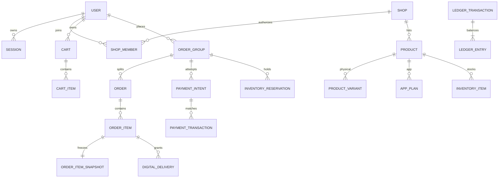

# Database ERD chi tiết

Schema executable nằm tại `../prisma/schema.prisma`. Tài liệu này mô tả ownership,
transaction boundary và các constraint cần bổ sung bằng SQL migration vì Prisma
không biểu diễn đầy đủ partial index/check/trigger.

## Quan hệ cốt lõi



## Ownership và nguồn sự thật

| Aggregate | Root | Tenant/user boundary | Nguồn sự thật |
|---|---|---|---|
| Identity | `users` | `user_id` | user/session tables |
| Shop | `shops` | `shop_id` + active membership | shop module |
| Listing | `products` | `products.shop_id` | product/plan/variant |
| Inventory | reservation | product -> shop | inventory rows under lock |
| Checkout | `order_groups` | `buyer_id` | immutable order snapshot |
| Seller order | `orders` | `shop_id` | order state/history |
| Payment | `payment_intents` | buyer/admin policy | provider transaction + intent |
| Finance | ledger transaction | account/shop | balanced immutable ledger |

## SQL constraints bắt buộc trong migration đầu

```sql
ALTER TABLE cart_items ADD CONSTRAINT cart_item_reference_ck CHECK (
  (product_type = 'PHYSICAL' AND product_variant_id IS NOT NULL AND app_plan_id IS NULL)
  OR (product_type = 'DIGITAL_GAME_ACCOUNT' AND product_variant_id IS NULL AND app_plan_id IS NULL)
  OR (product_type = 'DIGITAL_APP_ACCOUNT' AND product_variant_id IS NULL AND app_plan_id IS NOT NULL)
);

ALTER TABLE inventory_reservations ADD CONSTRAINT reservation_target_ck CHECK (
  (inventory_item_id IS NOT NULL AND product_variant_id IS NULL AND quantity = 1)
  OR (inventory_item_id IS NULL AND product_variant_id IS NOT NULL AND quantity > 0)
);

ALTER TABLE product_variants ADD CONSTRAINT physical_stock_ck CHECK (
  stock_on_hand >= 0 AND stock_reserved >= 0 AND stock_reserved <= stock_on_hand
);

ALTER TABLE app_plans ADD CONSTRAINT app_plan_duration_ck CHECK (
  service_duration_value > 0 AND service_duration_value <= 1200
  AND warranty_duration_value >= 0 AND warranty_duration_value <= 1200
);

ALTER TABLE ledger_entries ADD CONSTRAINT ledger_amount_ck CHECK (amount > 0);
ALTER TABLE order_items ADD CONSTRAINT order_item_money_ck CHECK (
  quantity > 0 AND unit_price_amount >= 0 AND total_amount >= 0
);
```

Khi reservation active, application luôn ghi `active_key = 'ACTIVE'`; khi release/
consume đặt `NULL`. Unique `(inventory_item_id, active_key)` vì vậy chặn hai lượt giữ
cùng credential. Migration nên có trigger/deferred constraint kiểm tra mỗi
`ledger_transaction` POSTED có tổng debit bằng tổng credit theo currency.

## Query cạnh tranh

Credential được cấp trong transaction bằng SQL parameterized:

```sql
SELECT id
FROM inventory_items
WHERE app_plan_id = $1
  AND status = 'AVAILABLE'
ORDER BY created_at, id
FOR UPDATE SKIP LOCKED
LIMIT $2;
```

Với hàng vật lý, lock `product_variants`; điều kiện update là
`stock_on_hand - stock_reserved >= quantity`. Không read-then-write ngoài transaction.

## Index và lifecycle

- Query seller: `(shop_id, status, created_at)`; buyer: `(buyer_id, status, created_at)`.
- Payment: unique `(provider, external_transaction_id)` và unique `payment_code`.
- Worker: `(status, available_at)` cho outbox; `(status, expires_at)` cho reservation/intent.
- Search MVP: migration bật `pg_trgm`, GIN trên normalized name/description; JSON attribute
  chỉ index cho filter thực tế.
- Partition theo tháng khi cần: `audit_logs`, `payment_webhook_events`, outbox đã publish.
- Không cascade-delete order, payment, ledger, audit. Dữ liệu user được anonymize theo policy.

## Transaction boundaries

- Create order: consume checkout snapshot, lock cart/stock, tạo group/orders/items/
  snapshots/reservations/intent/idempotency/outbox trong một transaction.
- Confirm payment: insert provider transaction, lock intent/group/reservations, post ledger,
  transition state và outbox trong một transaction.
- Reveal: authorization + lock delivery, decrypt ngoài repository boundary, tăng counter và
  ghi audit. Plaintext chỉ tồn tại trong memory ngắn hạn.
- Refund/payout: lock wallet/accounts; tạo balanced entries; không update balance độc lập.

